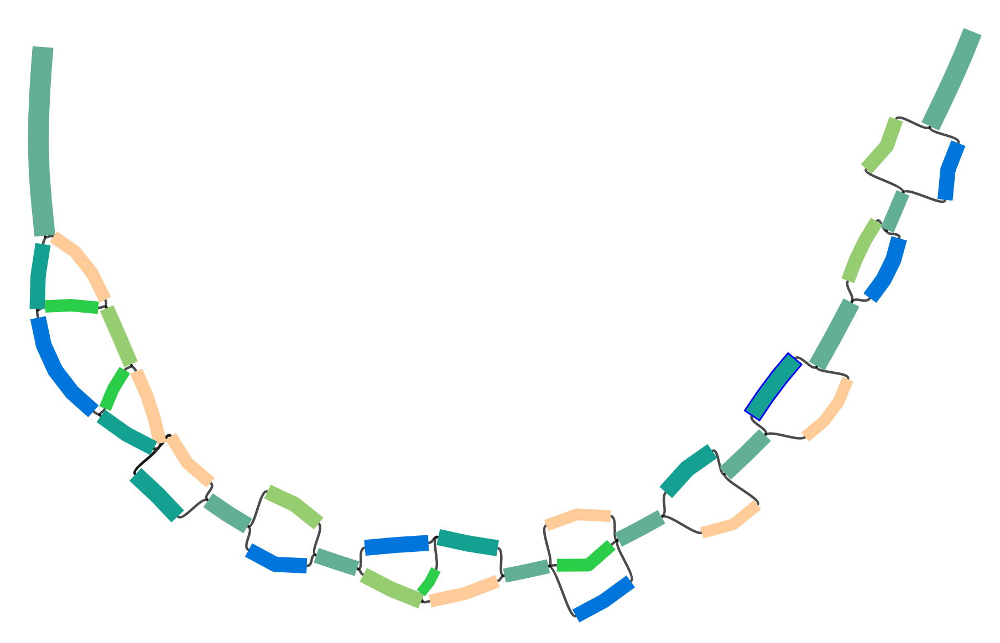

# BayesPaths

Package for performing structured variational inference of coverage across 
multiple samples on an assembly graph.

## Prerequisites

We will require pip and setuptools for package install and Python >= 3.6. Pip can be installed with:

```
sudo apt-get update
sudo apt-get install python3-pip
```

On an Ubuntu 18.04 distribution.

## Requirements

BayesPaths uses the python packages: biopython,statsmodels, pathos, matplotlib,numpy>=1.15.4,
scipy>=1.0.0,pandas>=0.24.2,networkx>=2.4,sklearn,pygam>=0.8.0,gfapy

But these should all be installed by setup.py below.

## Installation

Download repo and install:
```
git clone https://github.com/chrisquince/BayesPaths.git
cd BayesPaths
sudo python3 ./setup.py install
```

## Quick start

We have a precomputed set of single-copy core gene graphs and coverage from the [STRONG](https://github.com/chrisquince/STRONG) pipeline 
placed in TestData.

We will run BayesPaths on a single SCG, COG0060. First create a list of COGs to run:
```
echo 'COG0504' > COG0504.txt
```

In this case just one. 

```
mkdir Test504
bayespaths TestData 77 Test504/Test504 -r 150 -g 3 -l COG0504.txt -t Data/coreCogs.tsv --nofilter -nr 1 --norun_elbow --no_ard
```

This should take 5 - 10 mins to run. This COG only contains 37 nodes too few for automatic relevance determination so we deactivated that ***--no_ard*** and 
set the number of strains to the correct number three ***-g 3***. The option ***-r 150***
sets the sequence length.
 The ***-l*** option specifies the list of COGs to run ***-t*** points to a file of COG lengths in amino acids 
which are used to help find sources and sinks on the graphs. 
The other options speed up the run  ***--nofilter***, ***-nr 1*** , ***--norun_elbow*** as a test case. See below 
for a detailed description of program arguments.

This will produce output files in the directory ***Test504*** these are also described in 
detail below but we use one the haplotype paths ***Test504/Test504F_Haplo_3_path.txt***
below to visualise the haplotypes:

```
python3 ./scripts/color_graph.py ./TestData/COG0504.gfa -p Test504/Test504F_Haplo_3_path.txt COG0504_color.gfa
```

This produces a coloured gfa ***COG0504_color.gfa*** for this COG which in [Bandage](https://rrwick.github.io/Bandage/) should appear similar to:



### Full test run

A complete run of this MAG using all 35 single-copy core genes in file ***TestData/selected_cogs.tsv*** would be run as follows:

```
mkdir TestRun
bayespaths TestData 77 TestRun/TestRun -r 150 -g 8 -l TestData/selected_cogs.tsv -t Data/coreCogs.tsv --nofilter -nr 1 --norun_elbow 
```

This will take a 10-15 minutes. Here we have enabled automatic relevance determination. The program using all the COGs is able to automatically determine that three COGs are present. We have though still deactivated filtering and restricted the NMF initialisation to a single iteration ***--nofilter -nr 1***. The recommended usage on real data would be:

```
mkdir TestRunF
bayespaths TestData 77 TestRunF/TestRunF -r 150 -g 16 -l TestData/selected_cogs.tsv -t Data/coreCogs.tsv  
```


## Input files

## Output files

## Program arguments

A full list of bayespaths arguments is obtained by typing:
```
bayespaths --help
```
Which should produce output:
```
usage: bayespaths [-h] [-l [COG_LIST]] [-t [LENGTH_LIST]] [-f [FRAC_COV]]
                  [-nf [NOISE_FRAC]] [-m [MIN_COV]] [-mf [MIN_FRAC_COV]]
                  [-g [STRAIN_NUMBER]] [--loess] [--no_gam] [--no_ard]
                  [--no_noise] [-i ITERS] [-nfo NOFOLDS] [-r [READLENGTH]]
                  [-s RANDOM_SEED] [-e [EXECUTABLE_PATH]]
                  [-u [UNCERTAIN_FACTOR]] [-nr NMF_ITERS] [-ngf MAX_GITER]
                  [--noscale_nmf] [--nofilter] [--norun_elbow] [--norelax]
                  [--nobias] [--bias_type {unitig,gene,bubble}]
                  [--tau_type {fixed,log,empirical,auto,poisson}]
                  [--nogenedev]
                  Gene_dir kmer_length outFileStub

positional arguments:
  Gene_dir              directory with gfa files in
  kmer_length           kmer length assumed overlap
  outFileStub           output file stub

optional arguments:
  -h, --help            show this help message and exit
  -l [COG_LIST], --cog_list [COG_LIST]
  -t [LENGTH_LIST], --length_list [LENGTH_LIST]
                        amino acid lengths for genes
  -f [FRAC_COV], --frac_cov [FRAC_COV]
                        fractional coverage for noise nodes
  -m [MIN_COV], --min_cov [MIN_COV]
                        min. sample coverage
  -mf [MIN_FRAC_COV], --min_frac_cov [MIN_FRAC_COV]
                        min. fractional sample coverage
  -g [STRAIN_NUMBER], --strain_number [STRAIN_NUMBER]
                        maximum number of strains
  --loess
  --no_gam
  --no_ard
  --no_noise
  -i ITERS, --iters ITERS
                        number of iterations for the variational inference
  -nfo NOFOLDS, --nofolds NOFOLDS
                        number of folds for the CV analysis
  -r [READLENGTH], --readLength [READLENGTH]
                        read length used for sequencing defaults 100bp
  -s RANDOM_SEED, --random_seed RANDOM_SEED
                        specifies seed for numpy random number generator
                        defaults to 23724839 applied after random filtering
  -e [EXECUTABLE_PATH], --executable_path [EXECUTABLE_PATH]
                        path to factor graph executable
  -u [UNCERTAIN_FACTOR], --uncertain_factor [UNCERTAIN_FACTOR]
                        penalisation on uncertain strains
  -nr NMF_ITERS, --nmf_iters NMF_ITERS
                        number of runs for NMF
  -ngf MAX_GITER, --max_giter MAX_GITER
                        number of rounds of gene filtering
  --noscale_nmf
  --nofilter
  --norun_elbow
  --norelax
  --nobias
  --bias_type {unitig,gene,bubble}
                        Strategy for setting coverage bias
  --tau_type {fixed,log,empirical,auto,poisson}
                        Strategy for setting precision
  --nogenedev
```

The program ***requires*** the following arguments:

1.***Gene_dir*** :              This directory contains the gene assembly graphs to run in the format gene_name.gfa together with the unitig sample coverages as gene_name.tsv. The 
assembly graphs should be in gfa format and the coverages as tab separated files with format:
```
Unitig\tcov1\t...\covS 
```
For ***S*** samples and without a header. These coverages are kmer coverages rather than read coverages with the two converted by the formula:
```
kmer_cov = read_cov.(R - k + 1)/R
```
where ***R*** is the read length and ***k*** the final kmer length used in 
de Bruijn graph construction. This directory should also contain a file gene_name.stops and gene_name.deadends which contain a list of unitigs that contain stop codons or are tips. These files can be empty but they must be present. The stops file is tab separated with format:
```
Unitig\tdirection1\tnpos 
```
The direction is simply the orientation of the unitig containing the stop and npos its position on the unitig. The latter though is not used in the algorithm so can be set to -1.
For an example input data dir see ***TestData*** in this repository.

2.***kmer_length*** :  kmer length used to construct assembly graph that the subgraphs are extracted from this is taken as the overlap length between unitigs in the gfa file. Currently we do not support graphs with varying unitig overlaps.

3.***outFileStub***  :  output file stub, all output files will have this string as a prefix.
  
  
The most important optional arguments are:
1. -g [STRAIN_NUMBER], --strain_number [STRAIN_NUMBER]: This is the maximum number of strains default 5, the program starts with this number of strains but if ARD is used then low abundance strains are dropped from the solution until the correct number is selected
2.   --no_ard: Turns off automatic relevance determination
3.   -r [READLENGTH], --readLength [READLENGTH]: read length used for sequencing defaults 100bp
4.  -l [COG_LIST], --cog_list [COG_LIST] : This is a list of gene names in the ***Gene_dir*** to run. If it is not given all genes are used. Specifying genes that are missing from ***Gene_dir*** will cause an error.
5. -t [LENGTH_LIST], --length_list [LENGTH_LIST] : This file should contain expected gene lengths in amino acids, it is used to constrain the search for sources and sinks in the graph. If not specified then no constraints are used
6. 

The other ***optional*** arguments relate to the algorithm and will need to be changed less often, in fact we recommend using the defaults in most situations:

1.  -h, --help : self explanatory
2. -f [FRAC_COV], --frac_cov [FRAC_COV] : Fractional mean coverage below which unitigs are treated as noise default is 0.02
3. -m [MIN_COV], --min_cov [MIN_COV] : default 1.0
4.  -mf [MIN_FRAC_COV], --min_frac_cov [MIN_FRAC_COV]: min. fractional sample coverage default 0.05
These two parameters control which samples are used samples with coverage smaller than min_cov or min_frac_cov*highest_sample_cov are filtered
5. --loess: Use Loess smoothing rather than Gam for noise modelling too slow for general use
6. --no_gam: Don't use recommend GAM models for noise but rather quadratic polynomial not recommended
7. --no_noise: Do not 
  -i ITERS, --iters ITERS: maximum number of iterations for the variational inference default 250
  
  -nfo NOFOLDS, --nofolds NOFOLDS
                        number of folds for the CV analysis
  -s RANDOM_SEED, --random_seed RANDOM_SEED
                        specifies seed for numpy random number generator
                        defaults to 23724839 applied after random filtering
  -e [EXECUTABLE_PATH], --executable_path [EXECUTABLE_PATH]
                        path to factor graph executable
  -u [UNCERTAIN_FACTOR], --uncertain_factor [UNCERTAIN_FACTOR]
                        penalisation on uncertain strains
  -nr NMF_ITERS, --nmf_iters NMF_ITERS
                        number of runs for NMF
  -ngf MAX_GITER, --max_giter MAX_GITER
                        number of rounds of gene filtering
  --noscale_nmf
  --nofilter
  --norun_elbow
  --norelax
  --nobias
  --bias_type {unitig,gene,bubble}
                        Strategy for setting coverage bias
  --tau_type {fixed,log,empirical,auto,poisson}
                        Strategy for setting precision
  --nogenedev


## Acknowledgements

This package uses code for a variational Bayesian NMF and cross-validation taken from the from repository [Fast Bayesian nonnegative matrix factorisation and tri-factorisation](https://github.com/ThomasBrouwer/BNMTF) authored by Thomas Brouwer.
We have included the Apache 2.0 license from that repo here. All rights to that code reside with Thomas Brouwer.


